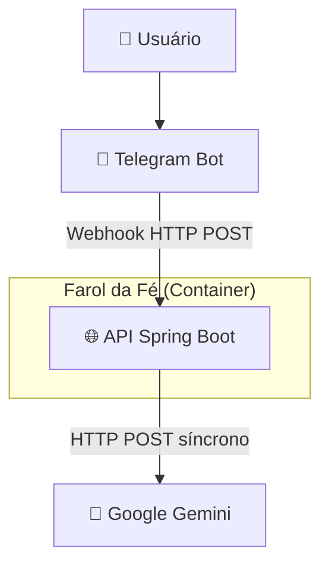
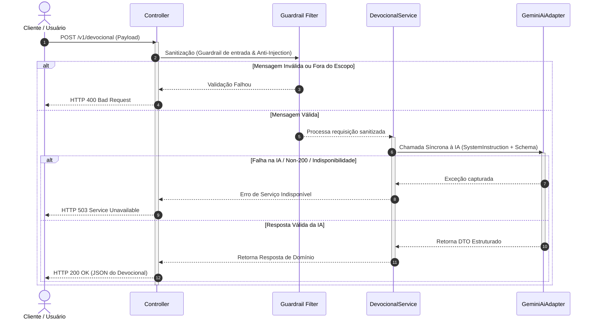

# Farol da Fé — Especificação de Arquitetura

**Tipo:** Especificação de Arquitetura de Software (SDD)  
**Autor:** Felipe Rodrigues  
**Status:** Refinado  
**Data:** 2026-08-09  

> Este documento define **como** o sistema é construído.  
> Para **o que** o produto faz, consulte a [Especificação de Produto](product.md).  
> Para o **porquê** de cada decisão técnica, consulte os [ADRs](adr/).

---

## 1. Visão Geral

A API Farol da Fé é o núcleo de processamento de reflexões bíblicas assistidas por IA Generativa. O fluxo de dados ocorre da seguinte forma:

1. Recebimento da requisição enviada por uma aplicação cliente (API REST) ou por integradores (Telegram Webhook).
2. Sanitização e validação prévia dos dados de entrada (Guardrails).
3. Processamento síncrono da solicitação junto ao provedor de IA Generativa.
4. Retorno da resposta estruturada ao cliente.
5. *(Fase 2)* Gravação assíncrona da interação em segundo plano para fins de auditoria e curadoria.

---

## 2. Estrutura da Aplicação

### 2.1 Microserviço Único
A aplicação é implementada como **1 único microserviço** ([ADR-004](adr/ADR004-plataforma-de-hospedagem-e-containerizacao.md)), pelos seguintes fatores:
* **Eficiência de Infraestrutura e Custos:** Operação simplificada na camada gratuita (*Free Tier*) de plataformas Serverless como Render (MVP) e Google Cloud Run (Pós-MVP).
* **Baixa Latência:** Eliminação de chamadas de rede internas entre serviços, reduzindo o tempo de resposta final.
* **Simplicidade Operacional:** Centralização de compilação, testes e implantação em um único artefato.

### 2.2 Arquitetura Hexagonal (Ports & Adapters)
A separação de responsabilidades é mantida através do padrão de Arquitetura Hexagonal:
* **Camada de IA:** A regra de negócio interage exclusivamente com a interface `GenAiPort`. A implementação utiliza o `GeminiAiAdapter` ([ADR-006](adr/ADR006-escolha-do-provedor-de-ia-generativa.md)). Essa abstração permite a substituição do provedor sem alterações na camada de domínio.
* **Camada de Auditoria (Fase 2):** A gravação de interações será realizada através da interface `AuditRepositoryPort`. No MVP da auditoria, será utilizado o `GoogleSheetsAdapter`, com migração futura para MongoDB ([ADR-009](adr/ADR009-estrategia-de-migracao-da-persistencia-de-auditoria-para-mongodb.md)).

### 2.3 Estrutura de Pacotes

```
io.github.razuoss.farol_da_fe
 ├── domain/                     # 🚫 NUNCA importar Spring ou frameworks aqui
 │    ├── model/                 # Entidades de domínio puras, Value Objects e exceções
 │    ├── port/
 │    │    ├── in/               # Interfaces de caso de uso (ex: DevocionalUseCase)
 │    │    └── out/              # Interfaces de saída (ex: GenAiPort, AuditRepositoryPort)
 │    └── service/               # Implementações puras das regras de negócio
 ├── infrastructure/
 │    ├── adapter/
 │    │    ├── in/web/           # Controllers REST, Webhook Telegram e DTOs (records)
 │    │    └── out/
 │    │         ├── genai/       # GeminiAiAdapter implementando GenAiPort
 │    │         └── audit/       # (Fase 2) GoogleSheetsAdapter implementando AuditRepositoryPort
 │    ├── config/                # @Configuration, Virtual Threads, Beans, CORS
 │    └── guardrail/             # Filtros anti-injection, sanitização e limites
```

### 2.4 Princípios Arquiteturais Invioláveis

1. **Isolamento de Domínio:** Classes em `domain/` nunca importam `org.springframework.*`, bibliotecas HTTP ou SDKs de terceiros. Todas as dependências apontam para dentro.
2. **Portas como Abstração:** Toda comunicação externa (GenAI, Auditoria) é abstraída por interface em `domain/port/out/`.
3. **Virtual Threads para GenAI:** Comunicação com GenAI é síncrona (HTTP POST). Virtual Threads (Java 21) garantem que I/O bloqueante não esgote threads do SO ([ADR-001](adr/ADR001-escolha-da-stack-de-tecnologia.md)).
4. **Imutabilidade de DTOs:** Sempre usar Java `record` para payloads de entrada, saída e estruturas de schema.
5. **Auditoria Fire-and-Forget (Fase 2):** Quando implementada, a auditoria executa de forma assíncrona (`@Async`). Falhas na auditoria nunca afetam o retorno `HTTP 200 OK`.
6. **Especificações de Funcionalidades (SDD):** A especificação de cada funcionalidade/feature deve residir no próprio pacote da feature em `domain/<feature>/SPEC.md`.
7. **Gestão de Segredos (Fail-Fast):** Segredos como `GEMINI_API_KEY` devem ser injetados via variáveis de ambiente. A aplicação deve falhar no startup (fail-fast) se chaves obrigatórias não estiverem presentes. Sob nenhuma hipótese os valores dos segredos devem ser logados.

---

## 3. Endpoints da API (Contratos REST)

### 3.1 Endpoint Principal do MVP: `POST /v1/devocional`
Endpoint REST para solicitação de reflexão bíblica devocional, conforme definido no [ADR-008](adr/ADR008-roadmap-de-endpoints-e-capacidades-teologicas.md).

**Payload de Entrada (JSON):**
```json
{
  "usuario_id": "123456",
  "solicitacao": "Mensagem de esperança"
}
```

**Payload de Saída (HTTP 200 OK):**
```json
{
  "titulo": "O Segredo do Contentamento",
  "texto_chave": "Filipenses 4:13 (NVT)",
  "contexto_historico": "Escrito pelo apóstolo Paulo enquanto estava prisioneiro em Roma...",
  "analise_texto": "No grego original, o verbo indica capacitação para enfrentar qualquer situação...",
  "aplicacao_pratica": "Aprender a ter contentamento tanto em momentos de necessidade quanto de fartura.",
  "oracao": "Senhor, ensina-me a descansar em Tua suficiência. Que a paz de Cristo domine meu coração em todas as circunstâncias.",
  "aviso_pastoral": "Nota: Este material é um apoio para meditação pessoal. Não substitui a leitura direta da Bíblia, a comunhão na igreja local e a orientação pastoral."
}
```

> **Extensibilidade ([ADR-008](adr/ADR008-roadmap-de-endpoints-e-capacidades-teologicas.md)):** Endpoints futuros como `POST /v1/exegese`, `POST /v1/compara-traducoes` e `POST /v1/sermao` reutilizarão a mesma estrutura arquitetural.  
> **Contrato formal:** [openapi.yaml](api/openapi.yaml)

---

### 3.2 Endpoint de Integração (Telegram): `POST /v1/webhooks/telegram`
Endpoint responsável por receber as notificações enviadas pela API de Webhook do Telegram.

**Campos do Envelope:**
* `update_id`: Identificador único da notificação gerado pelo protocolo do Telegram.
* `message.message_id`: Identificador sequencial da mensagem dentro do chat.
* `message.from.id`: Identificador do usuário no Telegram (utilizado para Rate Limiting).
* `message.chat.id`: Identificador do chat para envio da resposta.

**Payload do Webhook:**
```json
{
  "update_id": 987654321,
  "message": {
    "message_id": 42,
    "from": {
      "id": 123456,
      "first_name": "Usuario"
    },
    "chat": {
      "id": 987654
    },
    "text": "/devocional Filipenses 4:13"
  }
}
```

---

## 4. Comunicação com a IA (GenAI)

### 4.1 Natureza da Comunicação: Síncrona
A comunicação com a API do Google Gemini ([ADR-006](adr/ADR006-escolha-do-provedor-de-ia-generativa.md)) é realizada via chamadas **HTTP POST síncronas**, dispensando verificações periódicas de status.
* **Virtual Threads (Java 21):** O tempo de espera da resposta do modelo é gerenciado por Virtual Threads ([ADR-001](adr/ADR001-escolha-da-stack-de-tecnologia.md)). A thread do SO permanece liberada durante o bloqueio de I/O, otimizando concorrência e uso de CPU.

### 4.2 Recursos do Provedor de IA
* **System Instruction (`system_instruction`):** Instruções de sistema enviadas em canal isolado para delimitar o papel do modelo, manter o escopo teológico e aplicar diretrizes de conduta.
* **Structured Output (JSON Schema):** Imposição de esquema JSON na requisição, garantindo que o modelo responda estritamente no formato tipado definido pelo contrato da aplicação.

---

## 5. Resiliência, Segurança e Tratamento de Exceções

### 5.1 Defesa e Sanitização (Guardrail)
* **Limite de Tamanho:** O limite máximo da entrada de caracteres é centralizado no contrato `openapi.yaml`.
* **Proteção Anti-Prompt Injection:** Sanitização via expressões regulares para bloquear padrões conhecidos de *jailbreak* (ex: *"ignore as instruções anteriores"*).
* **Filtro de Escopo:** Rejeição imediata de mensagens fora do escopo bíblico/teológico antes do acionamento da IA.

### 5.2 Controle de Taxa (Rate Limiting)
* Aplicação do limite de **2 requisições por minuto por usuário** (`2 req/min`) através de controle em memória com Bucket4j ([ADR-007](adr/ADR007-definicao-de-metricas-e-estimativas-de-carga.md)).

### 5.3 Tratamento de Exceções e Cenários de Falha

| Cenário | Comportamento | HTTP Status |
| :--- | :--- | :--- |
| Entrada inválida, fora de escopo ou prompt injection | Rejeição imediata no guardrail | `400 Bad Request` |
| Rate limit excedido | Bloqueio via Bucket4j | `429 Too Many Requests` |
| API de IA indisponível (non-200 ou falha de rede) | Exceção capturada no `GeminiAiAdapter` | `503 Service Unavailable` |
| Timeout na chamada à IA (> 30s) | Interrupção via HTTP Client timeout comum (MVP) / Resilience4j ([ADR-011](adr/ADR011-padrao-circuit-breaker-e-resiliencia-com-resilience4j.md)) (Fase 2 - GCP) | `504 Gateway Timeout` |
| Schema mismatch / falha de parsing da resposta | Desserialização interceptada com fallback | `500 Internal Server Error` |
| *(Fase 2)* Falha na auditoria assíncrona | Log de erro interno, sem afetar resposta | Não impacta |

---

## 6. Diagramas Arquiteturais

### 6.1 Diagrama de Contexto



---

### 6.2 Diagrama de Sequência — Fluxo Principal (MVP)


