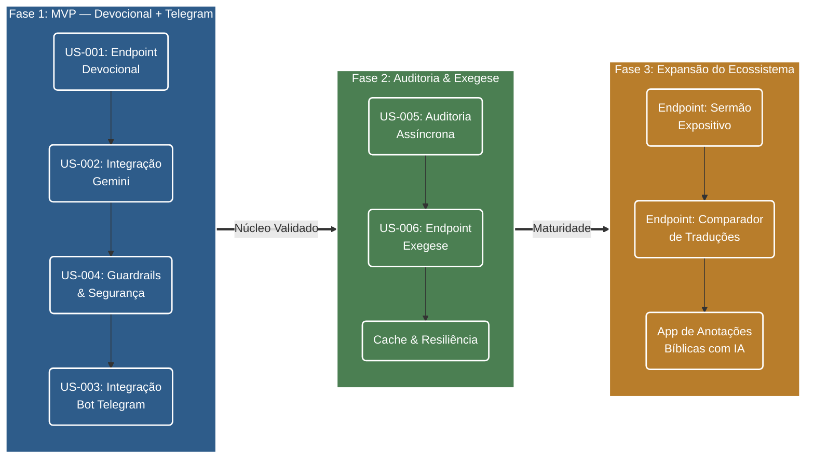

# Farol da Fé — Especificação de Produto

**Tipo:** Especificação de Produto (SDD)  
**Autor:** Felipe Rodrigues  
**Status:** Refinado  
**Data:** 2026-08-09  

> Este documento define **o que** o produto faz, para quem e por quê.  
> Para **como** é construído, consulte a [Arquitetura de Software](architecture.md).  
> Para o **porquê** de cada decisão técnica, consulte os [ADRs](adr/).

---

## 1. Propósito e Visão de Produto

### 1.1 O Problema
Cristãos em sua rotina diária, bem como líderes de pequenos grupos, professores e estudantes da Bíblia, frequentemente encontram dificuldades para realizar estudos bíblicos e exegéticos mais aprofundados. Entre os principais desafios estão identificar conexões entre passagens, compreender o contexto histórico-cultural, analisar termos nos idiomas originais (hebraico, aramaico e grego), entender o público-alvo e a intenção do autor, além de extrair aplicações práticas coerentes.

Ao utilizarem ferramentas genéricas de Inteligência Artificial (como chats públicos convencionais), principalmente com prompts simples, os usuários ficam expostos a respostas teologicamente imprecisas, desalinhadas do texto bíblico, prolixas, enviesadas ou com alucinações de máquina.

### 1.2 A Proposta de Valor
O **Farol da Fé** oferece uma camada especializada de apoio à interpretação bíblica, orientada pelos princípios do método gramático-histórico da tradição cristã histórica. O produto elimina a necessidade de engenharia de prompts pelo usuário e previne respostas inconsistentes.

Seu objetivo é gerar conteúdos estruturados, fundamentados no contexto histórico, público-alvo e idiomas originais, atuando como um assistente reverente — **sem jamais pretender substituir a leitura direta das Escrituras, a comunhão local ou o aconselhamento pastoral**.

### 1.3 Vantagens Estratégicas de Produto
1. **Consistência Teológica & Segurança:** Respostas alinhadas aos princípios exegéticos e governadas por guardrails de entrada e saída.
2. **Estrutura Tipada de Saída:** Informações organizadas em blocos previsíveis (Contexto Histórico, Análise do Texto, Aplicação Prática), facilitando a leitura e a integração.
3. **Visão API-First:** Inteligência de produto centralizada, permitindo servir a diferentes canais de experiência (Web, Bots de Mensagens, Mobile).
4. **Experiência Sustentável:** Arquitetura desenhada para entregar respostas rápidas e confiáveis com eficiência de custos.

---

## 2. Público-Alvo, Personas e Jobs to Be Done

### 2.1 Personas / Perfis de Usuário
1. **O Estudante Dedicado:** Cristão que deseja se aprofundar na Palavra, entender o contexto das passagens e encontrar correlações bíblicas consistentes para seu crescimento espiritual.
2. **O Líder de Estudo / Célula:** Precisa de apoio rápido e confiável para estruturar estudos bíblicos em grupo, extrair aplicações práticas e evitar interpretações superficiais ou incorretas ao ensinar.
3. **O Pregador Leigo / Pastor (Fase 3):** Busca insights exegéticos estruturados e organizados para fundamentar a elaboração de esboços de pregações expositivas.

### 2.2 Jobs to Be Done (JTBD)
Os usuários buscam:
- **[JTBD-1]** Obter uma análise bíblica ou devocional estruturada em poucos segundos;
- **[JTBD-2]** Reduzir o tempo de pesquisa de contexto histórico-cultural e consulta a termos originais;
- **[JTBD-3]** Ganhar confiança teológica para estudar e ensinar com fundamentação bíblica sólida;
- **[JTBD-4]** Receber respostas com tom respeitoso, objetivo e imediatamente acionável.

---

## 3. Jornadas do Usuário

### 3.1 Devocional Pessoal — MVP (US-001, US-002)
- **Ator:** Estudante Dedicado.
- **Gatilho:** Durante sua leitura diária, o estudante encontra um versículo ou tema cujo contexto deseja compreender melhor.
- **Passos da Jornada:**
  1. O usuário insere o texto ou dúvida (ex: *"Qual o significado e contexto de Filipenses 4:13?"*).
  2. O produto valida a mensagem e aplica os guardrails teológicos de entrada.
  3. O produto processa a reflexão devocional e retorna o resultado estruturado em blocos (Contexto Histórico, Análise do Texto, Aplicação Prática e Disclaimer).
  4. O estudante lê a reflexão, compreende o contexto e aplica a lição ao seu momento devocional.
- **Resultado Esperado:** Compreensão clara e contextualizada da passagem sem alucinações ou respostas prolixas.

### 3.2 Estruturação de Estudos — MVP (reutiliza US-001)
- **Ator:** Estudante de Teologia, líderes de grupos e professores de EBD.
- **Gatilho:** Necessidade de preparar o roteiro de perguntas e reflexões para a reunião semanal do grupo.
- **Passos da Jornada:**
  1. O usuário envia o tema ou passagem bíblica principal do estudo da semana.
  2. O produto retorna a análise com pontos de reflexão e aplicação prática direcionados ao cotidiano.
  3. O líder utiliza os insights estruturados como guia de discussão no grupo.
- **Resultado Esperado:** Ganho de tempo na preparação do estudo com garantia de fundamentação teológica segura.

### 3.3 Consulta via Telegram — MVP (US-003)
- **Ator:** Qualquer persona cadastrada no canal de mensagens.
- **Gatilho:** O usuário deseja consultar uma passagem bíblica pelo aplicativo de mensagens.
- **Passos da Jornada:**
  1. O usuário envia um comando ou mensagem de texto no chat do Telegram.
  2. O assistente recebe a mensagem, consulta a API do Farol da Fé e formata a resposta no aplicativo de chat.
  3. O usuário recebe o devocional formatado diretamente no canal de conversa.
- **Resultado Esperado:** Acesso ágil e contextual à inteligência do produto no aplicativo de preferência do usuário.

### 3.4 Elaboração de Esboço Expositivo — Fase 3
- **Ator:** Pregador Leigo / Pastor.
- **Gatilho:** O pregador está estruturando uma mensagem expositiva para a congregação.
- **Passos da Jornada:**
  1. O pregador solicita o apoio exegético e estrutural de uma passagem.
  2. O produto entrega a ideia central do texto, contexto histórico, pontos de divisão expositiva e aplicações práticas.
  3. O pregador refina o esboço para ministração pública.
- **Resultado Esperado:** Base homilética e exegética estruturada para apoiar a pregação expositiva.

---

## 4. Governança Teológica e Guardrails de Produto (US-004)

Para garantir a confiabilidade teológica e a proteção da experiência do usuário, o produto opera com três camadas de governança:

1. **Proteção de Entrada (Input Guardrail):**
   - **Tamanho Limite:** Entradas são limitadas a **1.000 caracteres**, garantindo espaço para perguntas contextuais e citações sem comprometer o escopo da resposta.
   - **Sanitização de Intenção:** Mensagens com tentativas de instrução maliciosa (*prompt injection* / *jailbreak*) são identificadas e bloqueadas.
   - **Filtro de Escopo:** Solicitações que não dizem respeito ao estudo bíblico, devocional ou reflexão cristã são recusadas de forma amigável antes do processamento pela IA.

2. **Diretrizes Hermenêuticas (System Instruction):**
   - Imposição do método gramático-histórico de interpretação.
   - Tom solene, reverente, pastoral e respeitoso.
   - Recusa graciosa e firme de polêmicas alheias à reflexão bíblica ou tentativas de debates ideológicos.

3. **Garantia de Saída Estruturada (Output Guardrail):**
   - O produto entrega respostas estritamente padronizadas em esquemas fortemente tipados.
   - Respostas incompletas, desformatadas ou fora do contrato de produto são tratadas com mensagens de fallback claras.

> Para detalhes de implementação técnica dos guardrails, consulte a [Arquitetura de Software — Seção 5](architecture.md#5-resiliência-segurança-e-tratamento-de-exceções).

---

## 5. Estratégia de Canais e Ecossistema (API-First)

O Farol da Fé adota a estratégia **API-First**:

- **Núcleo Centralizado:** A API REST centraliza a inteligência, guardrails e as regras de produto.
- **Ecossistema de Canais:** Aplicações de front-end (Web, Mobile) ou bots de mensagens atuam como integradores da API de produto, garantindo que qualquer evolução de inteligência beneficie todos os canais simultaneamente.
- **Canal do MVP:** No MVP, o canal de interação é o **Telegram Bot** via Webhook (US-003).

---

## 6. Escopo do Produto e Roadmap

### 6.1 MVP — Épico (Fase 1)

O MVP é composto pelas seguintes User Stories, que juntas entregam o produto mínimo viável:

| US | Descrição | Dependência |
| :--- | :--- | :--- |
| **US-001** | Endpoint `POST /v1/devocional` — núcleo de processamento de reflexões bíblicas | — |
| **US-002** | Integração com Google Gemini — motor de IA generativa com Structured Output | US-001 |
| **US-003** | Integração com Telegram Bot — canal de interação via Webhook | US-001 |
| **US-004** | Guardrails de entrada — sanitização, limites (1.000 chars) e filtro de escopo | US-001 |

> Para contratos e fluxos técnicos, consulte a [Arquitetura de Software](architecture.md).

### 6.2 Fora do Escopo do MVP
- Interface gráfica web ou aplicativo móvel nativo próprio;
- Gestão e autenticação de usuários finais com login/senha;
- Histórico pessoal persistido de pesquisas de usuários;
- Auditoria e curadoria de respostas (planejado para Fase 2 — US-005);
- Processamento de áudio/voz.

### 6.3 Evolução Funcional

- **Fase 2 (Auditoria & Expansão Exegética):**
  - US-005: Auditoria assíncrona não-bloqueante de interações para curadoria teológica ([ADR-009](adr/ADR009-estrategia-de-migracao-da-persistencia-de-auditoria-para-mongodb.md));
  - US-006: Endpoint de Exegese Aprofundada (`POST /v1/exegese`) ([ADR-008](adr/ADR008-roadmap-de-endpoints-e-capacidades-teologicas.md));
  - Cache de respostas frequentes via Redis ([ADR-010](adr/ADR010-estrategia-de-caching-de-respostas-de-ia-com-redis.md));
  - Circuit Breaker e resiliência operacional ([ADR-011](adr/ADR011-padrao-circuit-breaker-e-resiliencia-com-resilience4j.md)).

- **Fase 3 (Expansão do Ecossistema Teológico):**
  - Endpoint de Sermão Expositivo (`POST /v1/sermao`);
  - Endpoint de Comparação de Traduções e Termos Originais (`POST /v1/compara-traducoes`);
  - Concepção de aplicativo para anotações bíblicas com suporte de inteligência artificial.

> Roadmap completo de capacidades teológicas: [ADR-008](adr/ADR008-roadmap-de-endpoints-e-capacidades-teologicas.md).

---

## 7. Requisitos de Produto

### 7.1 Requisitos Funcionais (RF)
- **[RF-01]** Aceitar entradas do usuário em formato texto (perguntas, versículos ou temas bíblicos);
- **[RF-02]** Entregar respostas em campos tipados e organizados (Contexto Histórico, Análise do Texto, Aplicação Prática);
- **[RF-03]** Exibir disclaimer pastoral informando que o conteúdo é um recurso auxiliar e não substitui a Bíblia nem a comunhão local;
- **[RF-04]** Recusar requisições fora do escopo bíblico/teológico ou com comportamento malicioso;
- **[RF-05]** Disponibilizar o produto via canal de mensagens (Telegram Bot) no MVP;
- **[RF-06]** Manter documentação pública e atualizada do contrato de produto (OpenAPI/Swagger).

### 7.2 Requisitos Não-Funcionais (RNF)
- **[RNF-01] Confiabilidade:** Tratamento amigável de instabilidades do modelo de IA, evitando exibir erros brutos de código ou stack traces.
- **[RNF-02] Segurança:** Proteção contra manipulações de instrução (*prompt injection*) e vazamento de chaves ou dados internos.
- **[RNF-03] Desempenho:** Tempo de espera aceitável para o usuário final em chamadas síncronas de IA (meta p95 < 15 segundos).
- **[RNF-04] Auditabilidade (Fase 2):** Registro transparente de interações para curadoria teológica e melhoria contínua.

> Detalhes de métricas e observabilidade: [ADR-007](adr/ADR007-definicao-de-metricas-e-estimativas-de-carga.md).

---

## 8. Princípios de Experiência e Qualidade Teológica

O produto pauta sua experiência nos seguintes princípios:
- **Fidelidade Bíblica e Contextual:** Rigor interpretativo focado no contexto gramático-histórico da passagem;
- **Transparência e Humildade:** Clareza sobre os limites da inteligência artificial como ferramenta auxiliar;
- **Clareza e Objetividade:** Respostas diretas, bem estruturadas e sem prolixidade;
- **Cuidado Teológico e Pastoral:** Tom solene, reverente e pastoral, sem posturas provocativas;
- **Previsibilidade:** Garantia de saídas completas e alinhadas ao formato esperado pelo usuário.

---

## 9. Métricas de Sucesso do Produto (KPIs)

1. **Assertividade Teológica:** Taxa de conformidade teológica > 95% em amostragem de auditoria de respostas.
2. **Confiabilidade da Entrega:** Taxa de erros percebidos pelo cliente (`5xx`) inferior a 1%.
3. **Eficiência de Guardrails:** Barragem eficaz de solicitações fora de escopo ou maliciosas na entrada.
4. **Aderência ao Formato:** 100% das saídas entregues no formato estruturado especificado.

---

## 10. Definição de Pronto (Definition of Done)

Um incremento de funcionalidade do Farol da Fé é considerado **Pronto (Done)** quando:
- O contrato da funcionalidade estiver especificado e documentado em padrão OpenAPI;
- Os guardrails teológicos e de segurança estiverem ativos e testados;
- As respostas tiverem sido validadas quanto ao alinhamento hermenêutico e formato de saída;
- Os testes unitários e de integração estiverem cobrindo o fluxo.

---

## 11. Glossário de Vocabulário Ubíquo do Domínio

| Termo | Slug | Descrição |
| :--- | :--- | :--- |
| **Devocional** | `devocional` | Formato focado em reflexão espiritual e aplicação prática para a vida diária. |
| **Exegese** | `exegese` | Análise bíblica aprofundada considerando contexto histórico-cultural, público-alvo, idioma original e intenção do autor. |
| **Guardrail** | `guardrail` | Mecanismos automatizados de segurança e validação teológica para filtragem de entradas e saídas. |
| **Sermão Expositivo** | `sermao` | Estrutura homilética orientada à exposição e explicação pastoral de um texto bíblico. |
| **Structured Output** | — | Capacidade do motor de IA de responder estritamente dentro de um esquema tipado em JSON. |

---

## 12. Roadmap Visual de Evolução

