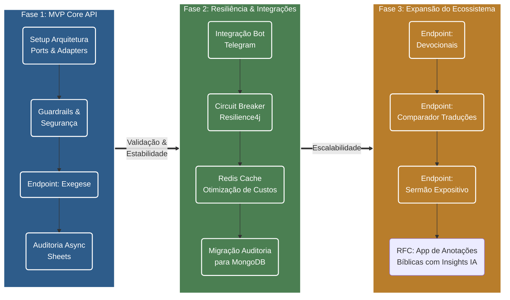

# Produto — Farol da Fé
**Assistente de estudo bíblico exegético e devocional**

**Status:** Draft (em refinamento)  
**Data:** 2026-08-04  
**Autor:** Felipe Rodrigues  
**Tipo de Documento:** Documento de Produto / Product Spec

---

## 1. Propósito e Visão

### O Problema
Cristãos em seu dia a dia, bem como líderes de pequenos grupos, professores e estudantes da Bíblia, frequentemente encontram dificuldades para realizar estudos exegéticos mais aprofundados. Entre os principais desafios estão identificar conexões entre diferentes passagens, compreender o contexto histórico-cultural, analisar termos nos idiomas originais (hebraico, aramaico e grego), entender o público-alvo e a intenção do autor, além de extrair aplicações coerentes com o texto bíblico.  

Ao utilizarem ferramentas genéricas de Inteligência Artificial (como o ChatGPT padrão), especialmente com prompts e/ou instruções simples, ficam expostos a respostas teologicamente imprecisas, enviesadas, liberais, invenções de máquina e/ou desvinculadas da ortodoxia cristã histórica.

### A Proposta de Valor
O projeto **Farol da Fé** surge para oferecer uma camada de apoio à interpretação bíblica, se posicionando como uma ferramenta de estudo bíblico e a meditação devocional, orientada por princípios exegéticos e hermenêuticos previamente definidos.  e consistentes com a tradição cristã histórica adotada pelo projeto, reduzindo a dependência de prompts complexos e minimizando respostas inconsistentes ou sem respaldo exegético  

Através de "guardrails" de segurança e prompts teologicamente alinhados à fé protestante histórica, seu objetivo é produzir respostas estruturadas, fundamentadas nas Escrituras, atuando como um assistente reverente, sem jamais pretender substituir a leitura direta das Escrituras, a comunhão local ou o aconselhamento pastoral.

Em resumo, o produto oferece quatro vantagens principais:

1. Consistência teológica: respostas produzidas com base em princípios exegéticos e guardrails definidos.
2. Estrutura de saída: respostas organizadas e fáceis de consumir, em vez de respostas textuais dispersas.
3. Escalabilidade: arquitetura preparada para uso como API e futura integração em outros canais.
4. Potencial de crescimento: base sólida para evoluir para novos produtos e experiências sem recomeçar do zero.

---

## 2. Público-Alvo

1. **O Estudante Dedicado:** Cristão que deseja se aprofundar na Palavra, entender o contexto das passagens e encontrar correlações bíblicas consistentes para seu crescimento espiritual.
2. **O Líder de Estudo / Célula:** Precisa de apoio rápido e confiável para estruturar estudos bíblicos, extrair aplicações práticas e evitar heresias ou interpretações rasas ao ensinar outras pessoas.
3. **O Pregador Leigo / Pastor (Fase 3):** Busca insights exegéticos estruturados para iniciar a formulação de esboços expositivos.

### 2.2 Jobs to be done

Os usuários querem, em essência:

- obter uma análise bíblica útil em poucos minutos;
- reduzir o esforço de pesquisa e organização de ideias;
- ganhar confiança para estudar e ensinar com base mais sólida;
- receber respostas que sejam claras, reverentes e acionáveis.

---

## 5. Escopo do Produto

### 5.1 MVP — Fase 1

O MVP deve concentrar-se em entregar uma API confiável e utilmente simples para o caso principal de uso:

- Endpoint principal de exegese: receber um texto ou tema e devolver uma resposta estruturada com contexto, análise, referências e aplicação prática.
- Mecanismos de segurança: proteção contra prompt injection e limite de tamanho de entrada.
- Resposta com qualidade consistente: formato claro, seguro e orientado ao uso real.
- Auditoria básica das interações para curadoria e melhoria contínua.

### 5.2 Fora do escopo do MVP

Os seguintes itens não fazem parte da primeira entrega:

- interface visual ou aplicativo próprio;
- integração direta com WhatsApp, Telegram ou outros canais de conversa como produto principal;
- autenticação complexa para usuários finais;
- histórico avançado de usuários;
- cache sofisticado ou persistência de alto nível para uso massivo;
- produtos complementares como app de anotações bíblicas.

### 5.3 Incrementos futuros

Em fases posteriores, o produto pode evoluir para:

- endpoint de devocional;
- endpoint de sermão expositivo;
- comparador de traduções e termos originais;
- integrações com canais de conversa;
- maior resiliência, segurança e escalabilidade operacional.

---

## 6. Requisitos de Produto

### 6.1 Funcionais

O produto deve:

- aceitar entradas em forma de texto ou tema bíblico;
- produzir respostas estruturadas e compreensíveis;
- incluir um posicionamento claro de que a resposta não substitui a leitura direta da Bíblia;
- respeitar limites de segurança e escopo teológico;
- oferecer uma base consistente para uso em integrações futuras.

### 6.2 Não funcionais

O produto deve ser:

- confiável, com respostas previsíveis e tratamento adequado de erros;
- seguro, com proteção contra entradas maliciosas e instruções fora do escopo;
- rápido o suficiente para uso prático, mesmo com latência natural de modelos de IA;
- preparado para evoluir sem perder clareza de produto ou qualidade de experiência.

---

## 7. Princípios de Qualidade

A experiência do produto deve seguir estes princípios:

- fidelidade ao texto bíblico e ao contexto;
- honestidade sobre limites da IA;
- clareza e objetividade na resposta;
- cuidado teológico e pastoral;
- ausência de respostas vazias, genéricas ou excessivamente improvisadas.

Esses princípios são centrais para a identidade do produto e para a confiança do usuário.

---

## 8. Métricas de Sucesso

O sucesso do produto será medido por indicadores claros:

- qualidade das respostas: alinhamento com o escopo teológico e a estrutura esperada;
- confiabilidade operacional: baixa taxa de falhas e respostas consistentes;
- performance: tempo de resposta adequado para uso real;
- valor percebido: capacidade de ajudar o usuário de forma prática e útil.

---

## 9. Roadmap de Entregas

O gráfico abaixo ilustra a esteira de evolução do produto, partindo da fundação da API (MVP) até a expansão para novos produtos do ecossistema.

