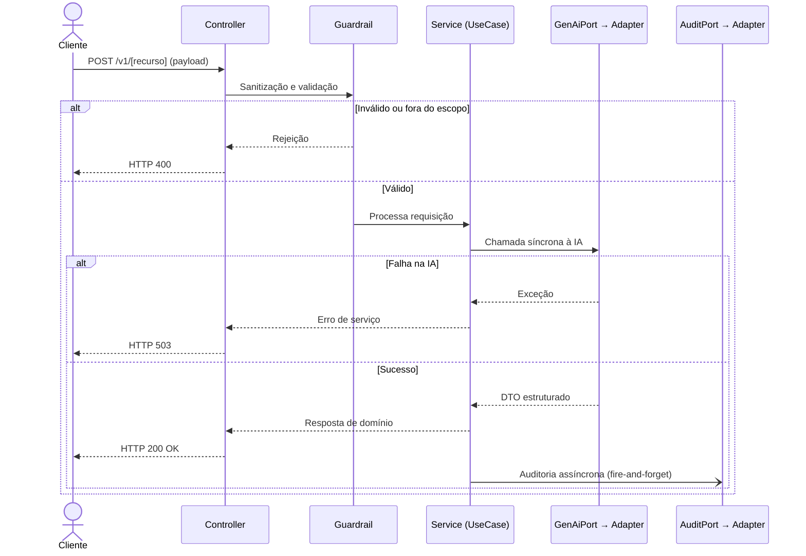

# Contrato de API: `[MÉTODO] /v[N]/[recurso]`

* **Status:** Rascunho | Estável | Depreciado
* **Data:** AAAA-MM-DD
* **Versão da API:** v[N]
* **US Relacionada:** _(US-NNN)_
* **ADR Relacionado:** _(ADR-NNN)_

---

## Visão Geral

| Campo | Valor |
|---|---|
| **Método HTTP** | `POST` / `GET` / `PUT` / `DELETE` |
| **Rota** | `/v[N]/[recurso]` |
| **Autenticação** | Nenhuma (MVP) / API Key / Bearer Token |
| **Rate Limit** | 2 req/min por `usuario_id` |
| **Content-Type** | `application/json` |
| **Descrição** | _[O que este endpoint faz em uma frase.]_ |

---

## Request

### Headers

| Header | Obrigatório | Descrição |
|---|---|---|
| `Content-Type` | Sim | `application/json` |
| `X-Request-ID` | Não | UUID para rastreamento (recomendado) |

### Body (Payload de Entrada)

```json
{
  "campo_obrigatorio": "string",
  "campo_opcional": "string"
}
```

### Descrição dos Campos

| Campo | Tipo | Obrigatório | Restrições | Descrição |
|---|---|---|---|---|
| `campo_obrigatorio` | `String` | Sim | Máx. 1.000 chars | _[Descrição do campo]_ |
| `campo_opcional` | `String` | Não | — | _[Descrição do campo]_ |

### Exemplo de Request

```bash
curl -X POST https://[host]/v1/[recurso] \
  -H "Content-Type: application/json" \
  -d '{
    "campo_obrigatorio": "valor de exemplo"
  }'
```

---

## Response

### Sucesso — `200 OK`

```json
{
  "campo_resposta_1": "string",
  "campo_resposta_2": "string"
}
```

### Descrição dos Campos de Resposta

| Campo | Tipo | Descrição |
|---|---|---|
| `campo_resposta_1` | `String` | _[Descrição]_ |
| `campo_resposta_2` | `String` | _[Descrição]_ |

---

## Respostas de Erro

| Código HTTP | Cenário | Body de Exemplo |
|---|---|---|
| `400 Bad Request` | Payload inválido, campo obrigatório ausente ou fora do escopo bíblico/teológico | `{ "error": "Solicitação inválida ou fora do escopo." }` |
| `422 Unprocessable Entity` | Dados válidos sintaticamente, mas semanticamente inaceitáveis | `{ "error": "O conteúdo informado não pôde ser processado." }` |
| `429 Too Many Requests` | Rate limit excedido (2 req/min por usuário) | `{ "error": "Limite de requisições atingido. Aguarde 1 minuto." }` |
| `503 Service Unavailable` | Provedor de IA generativa indisponível (Circuit Breaker aberto) | `{ "error": "O serviço de IA está temporariamente indisponível." }` |
| `504 Gateway Timeout` | Timeout de 30s na chamada ao provedor de IA | `{ "error": "Tempo de resposta excedido. Tente novamente." }` |
| `500 Internal Server Error` | Falha inesperada no parsing da resposta da IA | `{ "error": "Não foi possível estruturar a resposta. Reformule a pergunta." }` |

---

## Fluxo de Processamento



---

## Regras de Negócio

<!--
Liste as regras de negócio específicas deste endpoint que não estão óbvias no contrato.
-->

1. _[Regra de negócio 1]_
2. _[Regra de negócio 2]_
3. **Guardrail:** Toda entrada é sanitizada contra padrões de prompt injection antes de atingir a camada de domínio.
4. **Auditoria:** Toda requisição bem-sucedida é registrada de forma assíncrona para fins de curadoria teológica.

---

## Notas de Implementação

* **Input Port:** `[NomeUseCase].java`
* **Output Port (IA):** `GenAiPort.java` → `GeminiAiAdapter.java`
* **Output Port (Auditoria):** `AuditPort.java` → `GoogleSheetsAdapter.java`
* **DTO de Entrada:** `[Nome]RequestDto.java`
* **DTO de Saída:** `[Nome]ResponseDto.java`
