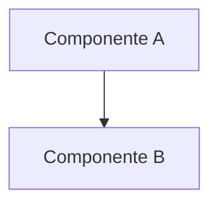

# RFC-[NNN]: [Título da Proposta]

* **Status:** Rascunho
* **Data:** AAAA-MM-DD
* **Autor:** [Nome]
* **Tipo:** Feature Nova | Mudança Arquitetural | Melhoria Técnica | Descontinuação
* **Impacto Estimado:** Alto | Médio | Baixo
* **Relacionado:** _(ADR-NNN, US-NNN, PRD-NNN)_

---

## Resumo Executivo

<!--
Escreva 2-3 parágrafos que qualquer pessoa técnica possa ler e entender
o "o quê" e o "por quê" desta proposta, sem precisar ler o documento inteiro.
-->

_[Descreva aqui a essência da proposta em linguagem clara e direta.]_

---

## Motivação

<!--
Qual o problema atual que justifica esta mudança?
- O que está funcionando mal ou deixando de funcionar?
- Qual oportunidade seria perdida se não agirmos?
- Há algum prazo, restrição ou evento externo que pressiona esta decisão?
-->

_[Descreva aqui o problema concreto que esta RFC resolve.]_

---

## Proposta Detalhada

<!--
Descreva a solução proposta com o nível de detalhe necessário para avaliação.
Inclua diagramas, fluxos, exemplos de código ou payloads quando relevante.
Esta é a seção principal do documento.
-->

### Visão Geral da Solução

_[Descreva a solução em alto nível.]_

### Impacto Arquitetural

<!--
Como esta mudança afeta as camadas da arquitetura hexagonal?
Quais portas, adapters ou serviços são criados/modificados/removidos?
-->

| Componente | Impacto | Descrição |
|---|---|---|
| `[NomeClasse.java]` | Criado / Modificado / Removido | |

### Diagrama _(opcional)_

---

## Alternativas Consideradas

<!--
Liste ao menos uma alternativa que foi avaliada e descartada.
Justifique por que a proposta principal foi escolhida em detrimento desta.
-->

### Alternativa 1: [Nome]
_Descrição da alternativa._

**Motivo da rejeição:** _[Por que não escolhemos esta opção.]_

---

## Impactos e Riscos

### Impactos Positivos
* _[Benefícios diretos da implementação.]_

### Riscos e Mitigações
| Risco | Probabilidade | Impacto | Mitigação |
|---|---|---|---|
| _[Descreva o risco]_ | Alta / Média / Baixa | Alto / Médio / Baixo | _[Como mitigar]_ |

### Breaking Changes _(se aplicável)_
* _[Liste qualquer mudança que quebre compatibilidade com versões anteriores.]_

---

## Plano de Implementação

<!--
Como esta proposta seria implementada na prática?
Liste as User Stories ou tasks que precisariam ser criadas no backlog.
-->

1. `[ ]` _[Task ou US a ser criada]_
2. `[ ]` _[Task ou US a ser criada]_
3. `[ ]` _[Task ou US a ser criada]_

**ADRs a serem criados/atualizados:** _(ADR-NNN)_

---

## Critérios de Aprovação

Esta RFC será considerada aprovada quando:
- [ ] A proposta técnica for revisada e não houver bloqueadores
- [ ] Os riscos identificados tiverem mitigações definidas
- [ ] O esforço estimado for validado e aceito
- [ ] ADR correspondente for criado com Status `Aceito`

---

## Perguntas em Aberto

<!--
Liste dúvidas ou pontos que ainda precisam de definição antes da aprovação.
-->

1. _[Pergunta ou ponto em aberto]_
